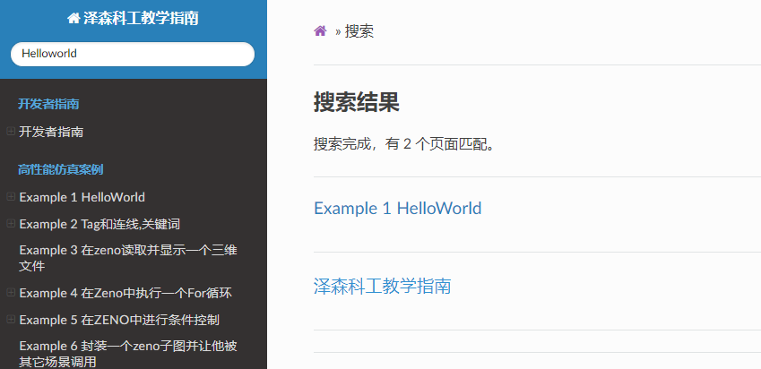

# ZENO生存指北
[《ZENO生存指北》](https://zenustech-documentation.readthedocs.io/zh/latest/)诞生于2021年7月23日。本手册旨在集中与分享在研发ZENO过程中的诸多感悟、经验和技巧。《ZENO生存指北》支持网页在线预览及信息检索。 我们希望本手册可以在我们和社区的共同维护下一直存活下去，并能给新入职的ZENO员工、在读学生、以及相关从业人员带来帮助。 感谢参与本手册编辑的作者们！同时期待更多作者们的加入！ 

网页同步版本网址：[《ZENO生存指北》](https://zenustech-documentation.readthedocs.io/zh/latest/)。下图截取时间：2021年1月27日。本网站将在社区的协助下持续更新。 

## 使用方法
《ZENO生存指北》支持随时随地网页访问，[《ZENO生存指北》网址](https://zenustech-documentation.readthedocs.io/zh/latest/)。用户可以在《ZENO生存指北》很方便地进行内容的检索。 

## 说明
本手册用reST语言撰写, 并支持Sphinx同步渲染。 

本手册结构如下：

    docs
    ├── index.rst               # 目录手册
    ├── conf.py                 # Sphinx网页渲染所需要的配置文件
    ├── content                 # 泽森科工教学指南手册主要内容
        ├── 开发者手册               # 
        │........

    
## 如何贡献（成为本手册的作者）
我们欢迎所有的泽森科工以及物理仿真人员贡献本手册。本手册用reST语言撰写。reST 被认为是简单，实用的标记语言. 这里是reST的[使用文档]。如果您想贡献本手册，可是不了解reST语言，没有关系，上述使用文档可以让你在10分钟以内上手。如果您不想学习reST语言，也没有关系，创建相应的文件（若所需文件不存在），在文件里写入必须的txt文字即可(不需要在乎格式）。  

详细步骤：

1. fork这个仓库(repo)。 如果已经fork，在你改动你的仓库之前，记得更新你的仓库。更新方法：在绿色的code下方点击一下fecth upstream,然后合并。如下图所示。

2. 修改你fork的repo。如何修改？例如想添加物理仿真信息，可以编辑'docs/content/'；想添加全新的小节，例如在开发者中加入 '流体仿真'节（假如没有这个小节），可以在'docs/content/ZENO'中新建'fluid.rst'文件，并添加相应内容，然后在`docs/index.rst`文件相应位置加入新的一行`content/ZENO/fluid`。  

3. 在本仓库中请求一个[pull request]. 点击new pull request, 点击compare across fork, pull request的左侧选中本仓库，右侧选中你的仓库。 确认后提交request. 

4. 审核通过后，您的内容将出现在本手册中。

 
NOTE: 如果需要加入图片，请参考docs/content/examples。并且把图片上传到docs/_static/image这个文件夹

## 我不想学Github的使用，我只是想贡献一份力量
如果您不想使用pull request功能，您依然有两种方法贡献《泽森科工教学指南》。

1. issue -> new issue -> 在issue内写下 相关文字即可。 会有管理人员将您的文字整理到手册里； 

2. 微信或电邮联系任何一个管理员，并写下 相关文字，我们会整理到手册中。 

## 联系管理员
如您有《ZENO生存指北》的相关问题，可以咨询管理员：  
* [Janice 张嘉瑶 ](https://github.com/jiayaozhang)
* [archibate 彭于斌](https://github.com/archibate)
* [littlemine 王鑫磊](https://github.com/littlemine)
* [zhxx1987 张心欣](https://github.com/zhxx1987)

以上就是全部啦，谢谢大家的贡献！！

