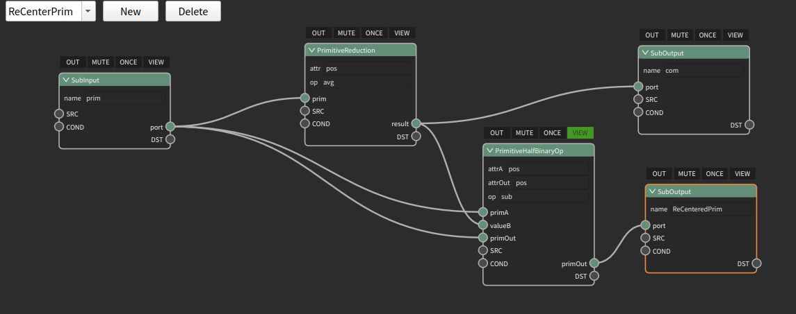

:github_url: https://github.com/guochengqian/KAUSTian_Handbook_CN

Example 6 封装一个zeno子图并让他被其它场景调用
=======

Zeno中最强大的功能之一就是用zeno封装子图并被zeno的其它场景作为一个节点调用. 由此可以两仪生四象 , 四象生八卦, 变化无穷.

下图:一个mesh和它被ReCenter(减去质心)后的位置

.. image:: ../../_static/image/Examples/6_1.jpg

开发一个subnet(子图)节点就如同开发一个函数, 可以自定义它的输入和输出, 以及它可能被可视化捕捉的对象, 在以下这个最简单的实现中, 我们展示了这样一个逻辑: 首先对于输入的图元, 我们对它进行ParallelReduce操作求其坐标"pos"的均值, 这就是它的几何质心(这基于它的每个三角形都差不多大, 如若不然我们可以使用remesh对它先做remesh). 然后, 我们将图元的每一个pos都减去这个均值, 就得到它被recenter后的坐标了. 我们再输出com以及prim, 以供后续节点使用

这样一个节点被封装完毕后, 它就和任何一个由cpp开发出来的节点一样可以被调用, 并且还可用于其它的子图中, 甚至自己调用自己(递归). 事实上, zeno的很多官方算法甚至都是由subnet开发的, 而非cpp开发.

未完待续.....

Example 7 在ZENO中编辑一个公式(zfx)

Example 8 在zeno中进行刚体仿真

Example 9 VDB以及体积操作的妙用

Example 10 在zeno中进行刚体仿真

Example 11 在zeno中进行流体仿真

Example 12 在zeno中进行MPM仿真

Example 13 在zeno中进行气体仿真

Example 14 在zeno中进行肌肉仿真

Example 15 在zeno中进行分子动力学仿真

Example 16 zeno的Wrangler

Example 17 用C++扩展zeno:如何用编程开发一个节点?

Example 18 用zeno扩展zeno, 以实现一个SPH解算系统为例

Example 19 ZENO与纯CPP开发出的并行程序的性能对比

Example 20 ZENO与直接开发cuda代码程序的性能对比

Example 21 场景实战: 狂风, 海中方舟, 镇龙塔倒, 龙腾出海.

Example 22 场景实战: 程序化生成场景

