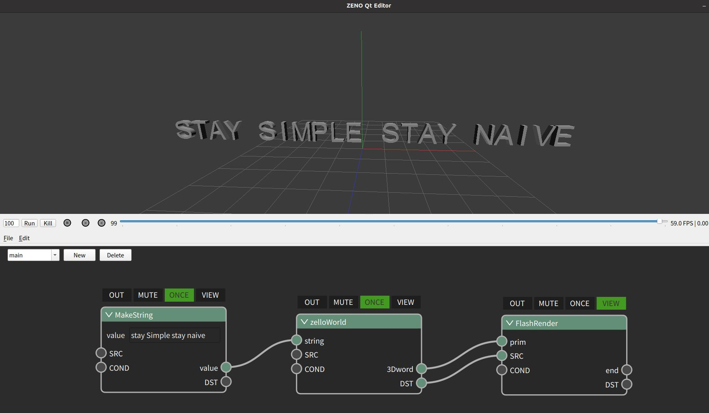

:github_url: https://github.com/jiayaozhang/ZenusTech-Documentation.git

Example 1 HelloWorld
=======

ZENO几个重要概念：
---------

1. 内置的几何数据结构
2. 可视化编程系统
3. 高性能计算框架
4. 软件以及官方用代码或者zeno的可视化编程本身开发的工具

在这个例子中， 我们演示了一个zelloWorld的简单案例， 这个案例有三个部分构成：用户提供一个字符串-->通过zelloWorld节点根据字符串产生3D字图形（只有大写）-->使用闪烁渲染进行可视化。同时，这也是一个典型的zeno界面， 它总共有这几个部分组成：一个三维观察窗口， 用于观察ZENO系统中的三维物体， 底下是一些frame调整功能， 再之下是节点编辑窗口， 这三者构成了ZENO的主要概念：对于时间轴的可视化编程。