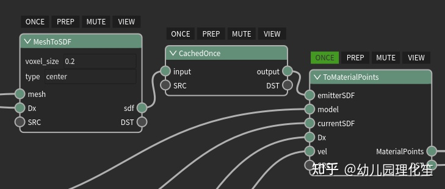
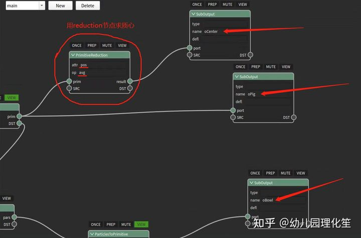
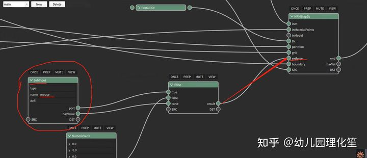
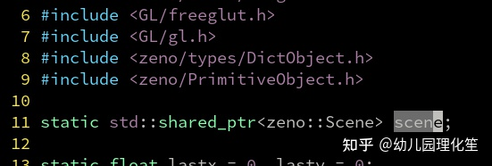

:github_url: https://github.com/jiayaozhang/ZenusTech-Documentation.git

在项目中嵌入式使用ZENO编辑器制作的计算图
============
ZENO人， ZENO魂， ZENO的技术very的纯。 今天为大家带来的是zeno计算图往其他项目中嵌入式使用的教程。
------------------------------------------------------------

人们都以为zeno是仅仅像blender， Houdini那样的一个封闭的软件使用环境，虽然节点化使得算法和仿真过程的开发非常灵活便捷，但似乎给人一种只能在zeno编辑器里用的错觉，就像blender的插件没法在blender外面使用一样，难以植入现有的项目里。

然而事实并非如此，zeno经过大神archibate和一众zeno工程师的精心开发，是一个稳健，灵活， 可移植性极强的工具链系统（我们甚至在安卓手机上跑过zeno），zeno的pyqt编辑器是zeno的冰山一角，并不是他的全部。

本期我们就探索如何通过导出基于zeno节点编辑器开发的GPU算法，在一个独立于zeno编辑器的C++程序里调用ZENO的计算图实现一个类似游戏的三维可交互软体仿真。

首先，我们打开官方提供的节点图lowResMPM.zsg：

.. image:: ../../_static/image/ZENO/c++/1.jpg

可以看到，这里存在着ONCE和PREP等tag，而这些仅仅对于编辑器中的使用环境，在嵌入式的场景里，我们这些tag是不起作用的（比如这个案例中是由GLUT的回调函数调用），因此无法在嵌入式环境下使用这些tag。解决方法是：

1. 我们把带ONCE的节点输出端口套上CachedOnce：

不过，实际上只需要在一条链的最末尾加上CachedOnce就可以了，这也是CachedOnce比ONCE tag方便的地方：前面整条链都只会执行一遍（早和心欣说这样比较方便了，他不信！by 心欣：擦， 各有优劣啊！）

2. 用For循环节点来控制substep运算：

.. image:: ../../_static/image/ZENO/c++/3.jpg

这里我们使用区间for循环，直接指定5个substep了。

    PREP节点则放到EndFor后面

然后就是重点的部分，VIEW tag在官方编辑器中代表送到可视化管线的操作。但是现在嵌入同理，我们也可以用SubInput从外部往zeno图里传数据，比如鼠标的拖动。式的环境下，我们希望把计算得出的结果送到外面调用该图的C++代码中，交给OpenGL来渲染。为了做到这一点，我们可以把main图看做子图，把所有需要从送到外部的数据，连到SubOutput上。

注意， 此处我们甚至连物体的质心坐标都使用PrimitiveReduction节点求了后顺便传递出去。 从而可以提供给外部系统进行拾取范围检测，或者用来绘制其它一些标记物（作用力箭头）

在嵌入式和子图中，所有的SubOutput所在的链都会被执行。

同理，我们也可以用“SubInput”示意从外部往zeno图里传数据，比如鼠标的状态信息：

可以看到这里我们使用了一个IfElse节点作为判断，SubInput的hasValue端口输出的是一个boolean类型对象。如果SubInput有输入，则使用；如果没有输入，则默认为（0，0，0）。之所以这样做是因为SubInput只有在嵌入式环境下有效，为了在zeno编辑器中调试，可以指定一个默认数值。

现在让我们看看所谓的“外面”，这时是怎么做相应调用的：

.. image:: ../../_static/image/ZENO/c++/6.jpg

可以看到这里首先是通过setGraphInput传入了鼠标提供的作用力矢量（作为NumericVec3），然后调用了applyGraph执行计算。再根据getGraphOutput按获取图中的输出端口（这里的名字"oPig", "oBowl"和之前图里的SubOutput是一一对应的）。

然后，就是调用OpenGL的API来绘制图形，可以看到obj2和obj3是zeno::PrimitiveObject类型，可以利用attr<T>("name")[i]来获取第i个粒子，类型为T，名字为name的属性值。

当我们编辑完算法图后， 我们可以直接在编辑器中运行， 查看各种参数下的运行的效果

当我们在这里反复运行调整好系统的参数后， 要把zeno计算图嵌入到C++中使用非常简单，我们只需要原地按下Ctrl-Shift-E（或者在菜单中File->Export也是可以的）

.. image:: ../../_static/image/ZENO/c++/7.jpg

选择导出到我们“外面”的工程文件夹里，比如就叫my_zeno_scene.h。

然后在main函数的最前面，只要用装大象三步法， 就能够把zeno的计算图进行导入：

.. image:: ../../_static/image/ZENO/c++/8.jpg

（这里如果你打开my_zeno_scene.h一看就会发现里面其实是一个json字符串……而loadScene只是从这个字符串里面加载图而已，并没有什么特别的）

其中scene变量的定义和所需的头文件如下：

当然，也不要忘了在cmake里链接zeno和zeno的各个扩展模块：

.. image:: ../../_static/image/ZENO/c++/10.png

在每一个画面的计算中， 程序对于zeno图的调用如下：

.. image:: ../../_static/image/ZENO/c++/11.jpg

编译后运行， 由于此时系统会把mouse的参数传递给计算图， 我们就能得到交互式运行的结果了：

那么王鑫磊同学开发这套MPM算法性能有多高呢？这里有16万个粒子，在RTX 2080上达到了实时运行和与玩家的输入进行交互。 

.. image:: ../../_static/image/ZENO/c++/12.jpg

在这整个搭建playable的实时弹性猪头交互的案例中， ZENO做到的最好的一点就是

“所见即所得”：可视化编程是看得见的， 可视化编程调试的结果是可以立刻看见的， 所需要的艺术效果的反复调试是可以快速执行的， 以及最终， zeno的工具流程即保证了嵌入式流程的简便性， 也保证了结果和软件编辑器中调制出来的高度一致。

请问：

使用zeno软件开发嵌入式的物理交互计算，

需不需要懂物理啊？！--- 不需要！

需不需要懂编程啊？！--- 不需要！

只要看了懂教程， 依葫芦画瓢， 展开想象力， 就可以给自己的想象插上翅膀。

所需要的， 只是自己的审美和对于艺术的反复追求。

正如皮克斯说过的： 艺术挑战技术， 技术启发艺术。 zeno工具和zeno工具人们， 将孜孜不倦地在科艺融合的道路上做好艺术家们，工程师的打工仔，

For the Imagineer Inside you！

ZENO本体和该展示性项目也已经全部开源

项目本体地址：https://github.com/zenustech/zeno

嵌入式案例地址：https://github.com/zenustech/zeno_embed_demo

主页： http://zenustech.com

#ZENO#
