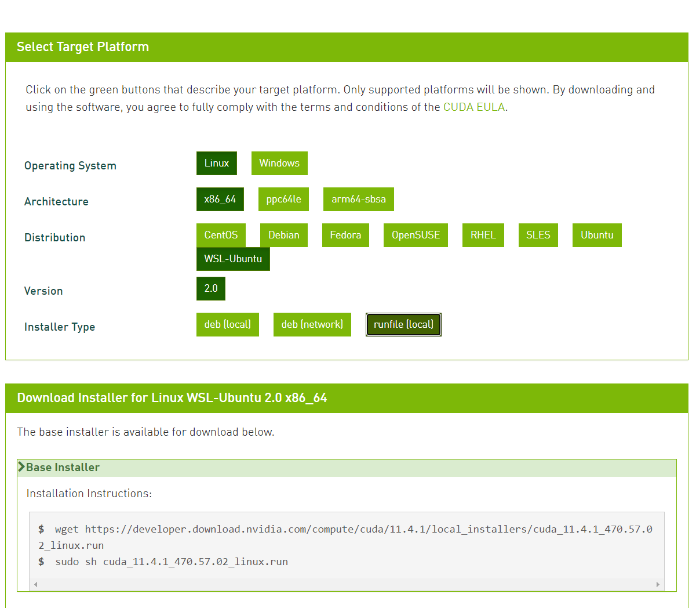

:github_url: https://github.com/jiayaozhang/ZenusTech-Documentation.git

生存指北
============
Unleash your genius to mimic the nature! 觅秘自然，势能不凡
------------------------------------------------------------

.. image:: ../../_static/image/ZENO/rigid3.jpg

特性
^^^^^
ZENO系统整合了多种处理复杂物理仿真场景的计算工具以及工具包， 借由拼接组合来给使用者提供出适应
各种复杂可能性的解决方案， 无论您是学生，极客， 创意工作者， 科研工作者， 都可以借助ZENO的工具链
令自己更好的聚焦于思维和设计。远离实现计算系统的繁杂以及保证得到最好的计算性能。

此处仅放两个由zeno产生的案例以供参考。

.. image:: ../../_static/image/ZENO/crag_hit_water.gif

.. image:: ../../_static/image/ZENO/shock.gif

.. image:: ../../_static/image/wave.gif

ZENO中的高性能计算框架ZPC
^^^^^^^^^^^^^^^^^^^^^^^^^

借助ZPC，开发者可以做到一次代码开发，无差别地在CPU和GPU上进行计算， 大大减少开发者面向异构计算设备
开发地精力

.. image:: ../../_static/image/ZENO/zencompute.png

ZENO的脚本语言Z{f(x)}
^^^^^^^^^^^^^^^^^^^^^^^^^^^^^^

借助Z{f(x)}, 用户可以直接在节点编辑器界面对目标进行计算控制, 借助于ZENO不同的Wrangler, 用户可以极其便捷地
对图元指定数学计算, 通过不同的Wrangler形式, Z{f(x)}可以达成几何处理, 可视化分析, 物理仿真模型与算法实现等多种
目的(详见我们之后的案例), 更重要的,  Z{f(x)} 可以无差别地并行运行在CPU和GPU上, 对于 Z{f(x)}的善加利用将大大地丰富
开发仿真案例地自由度与进行自定义计算的效率.

开发ZENO的原因
^^^^^^^^^^^^^^^^^^^^^^^^^^^^^^^^^^^^^^^^

目前，很多图形学艺术家都希望能通过可视化编程能高效快捷的开发出物理仿真和动画。

ZENO的目的就是通过节点仿真为图形开发者和艺术从业者提供极大的便利

一个很复杂的物理仿真可以通过简单的节点连接就能实现
这也是可视化物理仿真编程的魅力所在。七分钟不到就可以将逻辑与数据流清晰的可视化出来

.. image:: ../../_static/image/ZENO/lennardjones.jpg

灵活度
^^^^^^^^^^^^^^^
ZENO节点可以轻松的改变和调整结果，通过轻松的删除连线并重新连上节点。不像传统的仿真软件，有固定的功能，我们将算法拆散为独立的积木，通过连接积木上的节点我们就可以创造出我们自己的解算器。
而不会由于软件本身固有的功能而限制了开发。

.. image:: ../../_static/image/ZENO/FSI.gif

性能
-------------

ZENO节点主要是由c++来写的。通过Qt5编译器来连接节点，ZENO的开发者将保证其算法与代码的高性能性，用户只需要脑洞大开。如下图所示，ZENO连接出来的FLIP solver比state of art的商用解算器更省内存,也更快速.

.. image:: ../../_static/image/ZENO/FLIPSolver.jpg

控制流
^^^^^^^^^^^^^^^^^^^^^^^^
不像传统的节点系统（Blender)，ZENO有着很强的时间序列并提供了很多控制流节点包括CachedOnce, BeginForEach, EndFor等。这些就能帮你微调来适应真实的问题。

.. image:: ../../_static/image/ZENO/forloop.jpg

统一性
^^^^^^^^^^^^
尽管如今我们已经有很多节点系统了，但是他们都限制在一些特定的软件里面，比如Blender，Houdini, Unreal等等。
这些软件有很多节点和前提限制，导致开发人员很难拓展开。比如，一个在Blender做布料模拟的人很难在同时在houdini做流体仿真。这也是我们开发ZENO的主要目的。

.. image:: ../../_static/image/ZENO/demo_project.png

可拓展性接口
-------------

1. basic primitive ops (by @archibate)
2. basic OpenVDB ops (by @zhxx1987)
3. OpenVDB FLIP fluids (by @zhxx1987 and @ureternalreward)
4. Tree-code N-body (by @archibate)
5. Molocular Dynamics (by @victoriacity)
6. GPU MPM with CUDA (by @littlemine)
7. Bullet3 rigid solver (by @archibate)
8. Hypersonic air solver (by @Eydcao)

载入这些库可以将一系列的节点载入到zeno,同时你也可以在ZENO中加入自己的solver

.. image:: ../../_static/image/ZENO/demoprojgraph.jpg

整合性
-------------

与此同时，我们也把ZENO加入到了Blender插件里面，这样你就可以自由的发挥ZENO节点系统来画出你想要的物理仿真啦

.. image:: ../../_static/image/ZENO/blender.jpg

用户终端安装
^^^^^^^^^^^^

下载
-------------
点击到 release page, 然后勾选 Assets -> download zeno-linux-20xx.x.x.tar.gz. 解压zip文件, 然后 run ./start.sh, 然后节点系统的编译器就会自动显示出来

使用
---------------
在arts文件夹下面有一些样例图，你可以在编译器将他们打开然后设计出自己的物理仿真模型。 目前rigid3.zsg, FLIPSolver.zsg, prim.zsg, 和 lennardjones.zsg还在完善中
提示：如果想要运行一个100帧的动画，可以右上角的1改成100，并点击execute。

Bug 报告
-------------------
如果你发现binary版本不对或者不匹配，欢迎在ZENO下面提issue

开发者使用指南
^^^^^^^^^^^^^^^

安装需求
----------

你需要有 C++17 compiler, CMake 3.12+, and Python 3.6+ 来构建 ZENO; NumPy and PyQt5 运行ZENO的编辑器. Pybind11 或者 GLAD 是内置的，所以你不必担心是否需要自己安装

Arch Linux
-----------

.. code-block:: bash

    sudo pacman -S gcc make cmake python python-pip python-numpy python-pyqt5 qt5-base libglvnd mesa

Ubuntu 20.04
--------------

.. code-block:: bash

    sudo apt-get install gcc make cmake python-is-python3 python-dev-is-python3 python3-pip libqt5core5a qt5dxcb-plugin libglvnd-dev libglapi-mesa libosmesa6
    python --version  # make sure Python version >= 3.7
    sudo python -m pip install -U pip
    sudo python -m pip install numpy PyQt5

Windows 10
--------------
1. Install Python 3.8 64-bit. 重要: 确保你把python 3.8加入到路径里面! 重启后效果更佳！
2. 在命令行敲CMD并输入以下命令:

.. code-block:: bash

    python -m pip install numpy PyQt5

.. note::
     请注意：如果python的路径没有安装正确的话 ：），你会被指向Microsoft store 所以确保下载和安装成功，没有error，此外在安装的过程中遇到一般的warnings是ok的

.. warning::    
    当出现以下错误的时候: 
    
    .. code-block:: bash

        Could not install packages due to an EnvironmentError: 
        [Errno 13] Permission denied: 'c:\\python38\\Lib\\site-packages\\PyQt5\\Qt5\\bin\\d3dcompiler_47.dll'': 

这可能是由于杀毒软件导致的，可以尝试退出比如360杀毒软件： 因为他们可能会阻止 ZENO 复制 d3dcompiler_47.dll等各种dll文件 .

另外当你输入QtGui的时候，发现DLL输入失败：可以尝试安装 Microsoft Visual C++ Redistributable。

1. 安装 Visual Studio 2019 社区版或者更后的版本 ( C++17 支持的).

在WSL中安装完整的ZENO(部分失败)
===============================

1. 加入 windows 预览体验计划，将系统更新到 windows 11。

2. 用管理员身份打开命令行窗口，执行\ ``wsl --install``\ ，然后重启。\ `参考 <https://docs.microsoft.com/zh-cn/windows/wsl/install-win10>`__

.. figure:: ../../_static/image/install_on_wsl/intsll_wslg.png
   :alt: 

1. 安装gedit，如果能弹出窗口，表示\ `WSLg <https://github.com/microsoft/wslg>`__\ 安装成功。

.. figure:: ../../_static/image/install_on_wsl/use_wslg.png
   :alt: 

..

   `什么是WSLg <https://zhuanlan.zhihu.com/p/377263437>`__\ ：直接可以在wsl命令窗口中打开linux系统中的GUI程序，GUI程序的窗口就像是Windows中的普通程序一样显示。我希望能够安装有图形界面的WSL，这样才能使用ZENO。

   修改文件 /etc/apt/sources.list 更新ubuntu的源。

   .. code:: 

      deb http://mirrors.aliyun.com/ubuntu/ focal main restricted universe multiverse
      deb-src http://mirrors.aliyun.com/ubuntu/ focal main restricted universe multiverse

      deb http://mirrors.aliyun.com/ubuntu/ focal-security main restricted universe multiverse
      deb-src http://mirrors.aliyun.com/ubuntu/ focal-security main restricted universe multiverse

      deb http://mirrors.aliyun.com/ubuntu/ focal-updates main restricted universe multiverse
      deb-src http://mirrors.aliyun.com/ubuntu/ focal-updates main restricted universe multiverse

      deb http://mirrors.aliyun.com/ubuntu/ focal-proposed main restricted universe multiverse
      deb-src http://mirrors.aliyun.com/ubuntu/ focal-proposed main restricted universe multiverse

      deb http://mirrors.aliyun.com/ubuntu/ focal-backports main restricted universe multiverse
      deb-src http://mirrors.aliyun.com/ubuntu/ focal-backports main restricted universe multiverse

安装默认版本的zeno
------------------

基本照着Dockerfile来就行了

.. code:: 

   sudo apt-get update
   sudo apt-get upgrade -y
   sudo apt-get install -y wget git gcc g++ make cmake libboost-iostreams-dev libboost-system-dev libtbb-dev libilmbase-dev libopenexr-dev zlib1g-dev libeigen3-dev libopenblas-dev python-is-python3 python-dev-is-python3 python3-pip libglvnd-dev libglapi-mesa qt5dxcb-plugin

.. code:: 

   git clone https://gitee.com/codespace1212/c-blosc.git --depth=1 --branch=v1.5.0

.. code:: 

   cd c-blosc && mkdir build && cd build && cmake .. && make -j32 && sudo make install && cd ../..

.. code:: 

   git clone https://gitee.com/zeng_gui/openvdb.git --depth=1

.. code:: 

   cd openvdb && mkdir build && cd build && cmake .. && make -j32 && sudo make install && cd ../..

.. code:: 

   pip3 config set global.index-url https://mirrors.aliyun.com/pypi/simple/

.. code:: 

   pip3 install pybind11 numpy PySide2

.. code:: 

   cmake -B build
   make -C build -j16

运行

.. code:: 

    python -m zenqt

.. figure:: ../../_static/image/install_on_wsl/zeno_default.png
   :alt: 

安装完整版本的zeno
------------------

.. _安装cmake321:

安装cmake3.21
~~~~~~~~~~~~~

因为部分拓展的编译需要版本3.19以上的cmake，安装过程参考\ `Kitware APT
Repository <https://apt.kitware.com/>`__\ 。过程中可能需要输入用户密码，所以一行一行粘贴比较好。

.. code:: 

   wget -O - https://apt.kitware.com/keys/kitware-archive-latest.asc 2>/dev/null | gpg --dearmor - | sudo tee /usr/share/keyrings/kitware-archive-keyring.gpg >/dev/null
   echo 'deb [signed-by=/usr/share/keyrings/kitware-archive-keyring.gpg] https://apt.kitware.com/ubuntu/ focal main' | sudo tee /etc/apt/sources.list.d/kitware.list >/dev/null
   sudo apt-get update
   sudo rm /usr/share/keyrings/kitware-archive-keyring.gpg
   sudo apt-get install kitware-archive-keyring
   sudo apt-get install cmake

安装cuda
~~~~~~~~

安装驱动，然后安装cuda toolkits

最后安装完整的zeno
~~~~~~~~~~~~~~~~~~

gmpm部分安装失败，undefined
reference，提示gmpm有个.so文件没有链接成功。其他应该都能用。