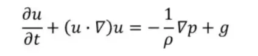
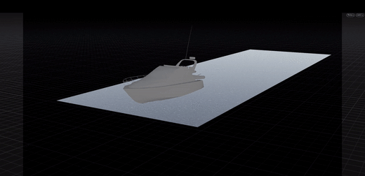

:github_url: https://github.com/jiayaozhang/ZenusTech-Documentation.git

Example 7 在ZENO中实现整个海洋
================================

.. image:: ../../_static/image/Examples/7.png

利用流体动力学制作视觉特效，已经成为“大片”的标配。

.. image:: ../../_static/image/Examples/7_1.gif

而诸如洪水、烟雾、爆炸等特效计算的背后，实际上是用计算机程序在求解已有百年历史的“纳维-斯托克斯方程”：

数十年来，科学家们为了计算机翼升力，已经从各个角度、各个姿势将其研究了百千遍。然而基于影视制作的特别需求，“水体模拟界”的特效工程师们对这个方程求解提出了新的要求。

既要减少计算的内存或时间消耗，又要适用于大面积、大范围、大体积水体运动的仿真。另一方面，现有的仿真技术，只能在有界（bounded）的范围内进行三维水体（volumetric）运动形态解算，镜头一旦拉远，就穿帮了。

如何低消耗地正确捕捉水体的形态、动态？近日，一篇题为”Ships, Splashes, and Waves on a Vast Ocean“, 论文的作者(一作 黄立博)来自于KAUST，泽森科工以及UCLA，作者将其放上了arXiv，并将发表于即将召开的图形学顶会siggraph asia 2021。

.. image:: ../../_static/image/Examples/7_4.gif

在论文中，研究员提出了一种大海域仿真计算技术：创新地将边界元技术与传统的FLIP水体仿真方法融会贯通，构造出了目前已知能以最高效的计算手段仿真最大体积、大范围海水的方法。

这项技术被reviewer称为：

“push the new visual SOTA”。

边界元技术通过对流体运动做有势无旋的假设，把大规模水体的“纳维-斯托克斯方程”简化成了伯努利方程：

.. image:: ../../_static/image/Examples/7_05.webp

伯努利方程可以在不可压无散假设下，将原本需要在三维网格上求解的方程转化为了只需要在水体的表面上就能定义和求解的拉普拉斯方程。将问题从3维转化为了2维，这十分吸引人。  然而由于自身的多种理论局限性（奇点，边界积分，拓扑变化等）， 不常见于复杂的流体仿真。

.. image:: ../../_static/image/Examples/7_5.webp

由于积分的奇点、控制方程的非线性、拓扑变化难以处理等问题，数学界论文中的“边界元法（BEM）”通常只能求解到波峰开始破碎的时刻。
更多信息参见论文：
Grilli et. al. A fully nonlinear model for three-dimensional overturning waves over arbitrary bottom, International Journal for Numerical Methods in Fluids
为此，研究者们在Da Fang et. al. 2016(Surface Only Liquids)的基础上，用工程技巧弥补理论不足，将BEM进一步推广成了一种稳定地、独立就能模拟复杂水体和边界运动的技术：

.. image:: ../../_static/image/Examples/7_6.gif

上图特效的计算，不存在三维仿真解算， 所有的计算未知量， 以及计算的时间积分量都仅仅存在于水体表面网格上，大大减少了计算的内存或时间消耗。
因此，这样的计算优势，正好适用于大面积、大范围、大体积水体运动的仿真。

.. image:: ../../_static/image/Examples/7_7.gif

如上所示，边界元建模由于对三维NS方程的近似足够充分， 足以自动地捕捉水体运动的细节现象， 包括翻卷的浪花。

.. image:: ../../_static/image/Examples/7_8.gif

借助边界元法和体积模拟解算技术的耦合， 研究者们将“近景“处用严谨的三维体积解算所带来的细节效果和波浪，成功地通过边界元的海水仿真传递了出去。
形象地说，是将“效果”传递到一个”无穷大“的海面上，并借由边界元海水的仿真，真实地创造了一个比三维解算深得多的”深海“。为近海面处水体的运动， 提供了正确的运动边界条件。

.. image:: ../../_static/image/Examples/7_9.gif

图注：左：SWE的结果， 波形、波速与参考解三维NS仿真相去甚远。中：参考解，三维NS仿真。右：BEM计算的结果。
对比一些顶级的影视技术公司曾采用的用shallowwater（潜水方程）来做海水拓展的技术方案。如上图所示，采用边界元以及伯努利方程这种建模方法得到的流体运动则和参考解十分吻合，同时大大降低了计算量。

为什么shallowwater效果不好，泽森科工的研究者表示：
“潜水方程由于在对纳维-斯托克斯方程简化的过程中做了过多简化假设（比如流体速度在y方向一致）， 所得出的结果，即使在不太深的水体运动中，也与真实解相去甚远， 难以捕捉大范围水体的真实运动。”
对于纳维尔斯托克斯方程的求解历久弥新，看来基于物理的计算仍然是人们再现自然现象的最佳手段。

.. image:: ../../_static/image/Examples/7_10.gif

图注：上：BEM+FLIP。中：参考解三维FLIP仿真（真心疼这台机器）。下：基于波动方程的仿真。

在与其它基于波方程求解的对比中，研究者们发现，采用BEM+FLIP求解的方案，既能得到准确的波形，也能得到更多的水流细节。

.. image:: ../../_static/image/Examples/7_11.gif

化有界为无界，便可以追求拟真的更高境。如上图中，可以看到前面的船产生的浪花甚至会影响到后面船体产生的浪花形态。

.. image:: ../../_static/image/Examples/7_12.gif

由于边界元方法给出的速度场是等效于体积求解的，虽然未知量只定义在边界上，却可以在整个体积内用边界积分方法得出任意点的正确流速， 这使得对获得的仿真数据进行后期加工成为了可能。
如上述动图所示，运用此方法，可以和任何标准化制作流程一样通过后期再对流体进行泡沫（white water）仿真解算来增加额外的细节和真实感。

