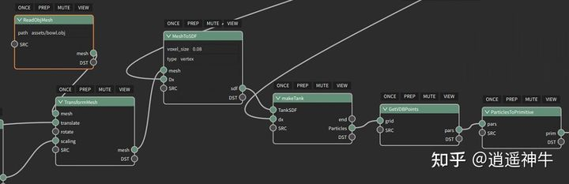
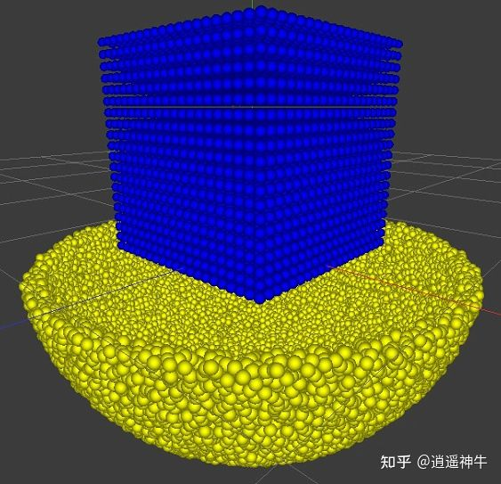
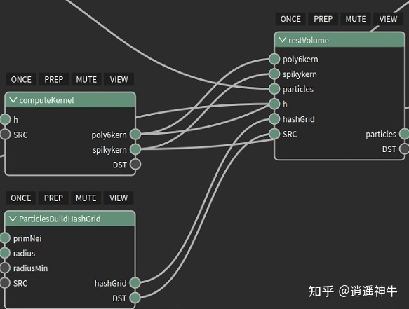
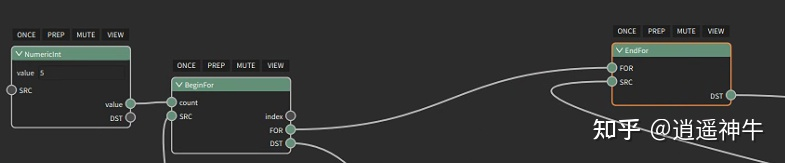
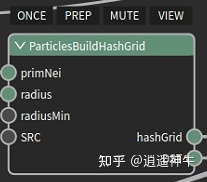
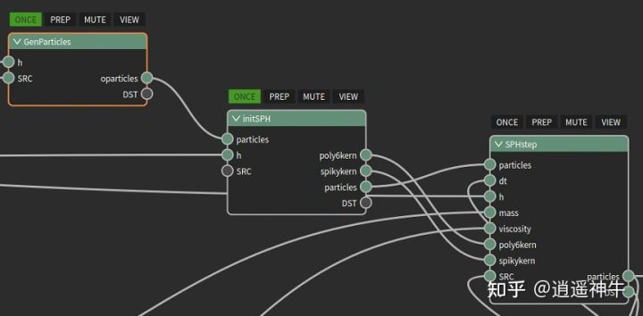

:github_url: https://github.com/jiayaozhang/ZenusTech-Documentation.git

ZENO上快速实现拉格朗日流体模拟功能
=================================

这篇文章将介绍如何使用zeno快速实现拉格朗日流体模拟。通过简单的连连看编程，即可实现场景布置、可视化效果；通过解释性语言zfx，无需编译，即可快速实现拉格朗日流体模拟。

背景介绍
^^^^^^^^^

1. ZENO

ZENO,是我司倾力打造出来的可视化“编程”工具。使用ZENO，可以极大程度上帮助我们从繁重的代码工作中解放出来。通过“连连看”的编程方式，即可快速搭建场景、构建模型以及实现模型的可视化。

2. ZFX

ZFX是ZENO自主开发的解释过程。ZFX设法把计算映射到预先编译好的函数指针的内存段中，这些函数在安装ZENO时即已编译完毕，后续用户使用无需再次编译，just in time!

3. 流体模拟

在流体的模拟中，主要分为拉格朗日视角下的流体模拟与欧拉视角下的流体模拟两类。从数学的角度看，欧拉视角下的流体模拟是对流体求解偏导运算；而拉格朗日视角下的流体，是对流体求解进行全导运算。

本文介绍了拉格朗日流体的模拟。在模拟中，我们采用了Smoothed Particle Hydrodynamics(SPH)技术。该技术将流体离散化为一个个带有质量的流体粒子，并通过与周围粒子进行插值操作计算流体域中的量。篇幅有限，本项目所涉及到的理论与算法，请查阅参考文献。

后面我们一步一步的来介绍，如何使用ZENO做出流体模拟的效果出来。

搭建场景
^^^^^^^^^^^^^^^

首先，我们需要搭建一个场景，为此我们创建了子图GenParticles。

我们可以使用ZENO自带的简单的节点MakeCubePrimitive生成一个立方体形状的流体。 这里我们以碗为例，构造碗的方式如下：

我们将这两个粒子模型合并在一起，作为该子图的输出：

.. image:: ../../_static/image/Z{f(x)}/exp3.jpg

这样我们的场景即可搭建完毕。

搭建准备
^^^^^^^^^^^^^^^^^^

为了搭建一个隐式不可压缩SPH流体模型，我们首先对我们的粒子做好准备工作。为此，我们新建了子图initSPH。

.. image:: ../../_static/image/Z{f(x)}/exp5.jpg

在这个子图里我们首先添加了粒子所需要的属性。随后计算每个粒子的标准体积：

这个粒子准备步骤，整个仿真过程只需要执行一次，因此打上一个once标记

.. image:: ../../_static/image/Z{f(x)}/exp7.jpg

后面就进入到了每个时间步的循环迭代中。

搭建构建
^^^^^^^^^^^^^^^^^^^^

在每个时间步，我们需要去求解流体运算的Navier-Stokes方程。在这个过程里，最花费时间的是使得流体不可压缩的压强力的计算。该项目目前考虑了流体的粘性、重力以及压强力，我们采用分步积分的方式，先去求解流体的粘性与重力，随后放入压强的泊松方程中去计算压强力。为此，我们在子图SPHstep里作如下设计：

.. image:: ../../_static/image/Z{f(x)}/exp8.jpg

第一个节点计算了求解压强的泊松方程里的常数项，包括当前粒子的体积、速度的散度等。第二个节点进入了Jacobi迭代求解压强的过程。第三个节点对粒子所受到的压强力做对流积分。这三个节点内部均由ZENO节点与ZFX实现。

以computePress节点为例证明我们系统构建的方便性。下图是Jacobi迭代的控制流程：

将BeginFor与EndFor节点的FOR接口连起来做配对，DST与SRC端口之间的节点即循环所执行的代码。

循环的第一步，我们先计算压强加速度，这通过如下方式计算：

.. image:: ../../_static/image/Z{f(x)}/exp10.jpg

其中hashGrid通过ZENO提供的ParticlesBuildHashGrid节点实现。该节点将流体粒子离散化到三维网格中。

而在ParticlesNeighborWrangle节点内部，通过hashGrid查询粒子的邻域网格，实现近邻粒子的快速查询。而zfxCode端口则接入我们希望执行的zfx代码。由于zfx的特殊设计，写完即可立即执行无需编译，简直不能更爽，这一点相信写过大型程序的同学们肯定深有体会。

照猫画虎的，将算法的整个流程在ZENO上实现完成，即可看到最终的效果：

.. image:: ../../_static/image/Z{f(x)}/sph.gif

模块化使用
^^^^^^^^^^^^^^^^^^^^^^^^^^^^^^^^

我们将模型封装成子图后，后续如果我们还需要使用时，仅需要调用这三个节点，输入对应的参数即可快速搭建SPH流体模拟器，集成度非常高。

编程调试
^^^^^^^^^^^^^^^^^^^^^^^^^^^^^^^^^^^^

ZENO提供了很方便的调试工具。在这个可视化编程工具里，我们不仅可以避免等待编译的痛苦，还可以通过heatmap来查看每个粒子的状态。如下图所示，我们使用蓝色来对粒子进行着色，颜色越深则速度越小。可以看到，边界处的流体速度较快，而中心区域的流体速度小，这给了我们一个很直观的效果。

.. image:: ../../_static/image/Z{f(x)}/exp13.jpg

同时，还可以通过调节粒子的半径，来判断该粒子当前的体积大小。可以看到，外围的粒子因为邻域粒子少，体积较大；碗内部的粒子密集，所以体积较小。

.. image:: ../../_static/image/Z{f(x)}/exp14.jpg

参考文献
^^^^^^^^^^^^^^^^^^^^^^^^^^^^^^^^^^^^^^^^^^^^^

Müller M, Charypar D, Gross M H. Particle-based fluid simulation for interactive applications[C]//Symposium on Computer animation. 2003: 154-159.

Band S, Gissler C, Ihmsen M, et al. Pressure boundaries for implicit incompressible SPH[J]. ACM Transactions on Graphics (TOG), 2018, 37(2): 1-11.