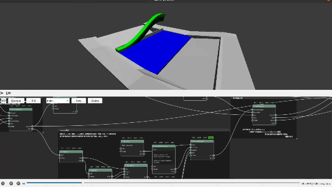
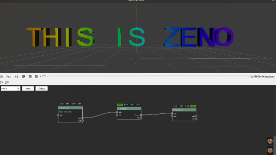

:github_url: https://github.com/jiayaozhang/ZenusTech-Documentation.git

ZENO中的Z{f(x)}功能
===================

Z{f(x)}是zeno使用的脚本语言，该脚本语言语法简便，可用于描述一个简单的数学公式，一经实现，可并行地运行在CPU或者GPU设备上，是场景编辑的强大工具。

它支持用户编辑一段数学公式, 并行地对几何或者仿真数据进行计算编辑, 一个zfx脚本以及一个参数列表我们称之为 Wrangler,   用于接收Wrangler并并行处理仿真数据的节点则是Wrangle.(该叫法来自于Houdini).  我们对物理仿真计算做了5中抽象Wrangle, 目前来看, 足以支持从分子动力学仿真, 到SPH仿真, 到粒子-网格仿真, 到天体力学仿真的所有物理计算模式.

.. image:: ../../_static/image/Z{f(x)}/zh1.jpg

值得一提的是, zfx结合wrangle是可以无差别地并行运行在CPU以及GPU上的, 在我们的测试中, wrangle(GPU模式)比wrangle(CPU模式)有100倍的加速比. Z{f(x)}的运行无需编译, 无需编译, 无需编译. 这大大加速了仿真设计者(TD)对于场景的开发自由度.

比如以下这个场景

.. image:: ../../_static/image/Z{f(x)}/6.png

一个类似于海滩的设置, 用来研究海浪在海滩边卷起的样子和能量. 在这个场景中, 如何产生海浪的边界条件是个问题, 我们参考现实中 wave pool(海浪池)的机械原理, 用zfx制作了我们的海浪产生装置

总结

造浪器优于海浪边界速度方程在于它不会向水体中emit新的水也不用设置过于复杂的出口条件, 基于物理实际环境, 只要把造浪器的机械运动规律调整正确, 基本上就可以获得足够真实的海浪运动.Z{f(x)}作为一个zeno的新特性, 具有并行化, GPU/CPU无差别运行等优势, 且无需编译, 可以快速地提供给创作者用以对场景进行编辑和调整, 快速得到反馈, 产生更多样的变化和结果. 在这个场景中很快地编辑出了造浪器的运动模型. 以上场景仿真耗时约2小时. 每帧约5000万粒子. 以1/24秒为frame单位, 共仿真300frame, 播放120~288.

.. raw:: html

<video controls src="../_static/image/wave.mp4"></video>

一个简单的ZFX使用场景如下所示：

.. image:: ../../_static/image/Z{f(x)}/1.png

在这个场景中每个frame， zfx所表达的运算会被并行地施加给prim端口连入的几何图形，该根据ZFX所述， 该物体的pos会从它最初的位置被沿着法线方向往复反转， 其中time是我们从参数列表中获取进来的系统级变量， 它由GetTime函数来得到。
这个案例的运行结果如下所示：

.. image:: ../../_static/image/Visual/zfx.gif

@符号表示这个变量属于被修改的primitive, 或者原primitive没有, 会被添加上去.  
$的意思是这是一个dict传递进入的变量.
此外@pos @nrm @clr @vel @rad等关键字, 是保留关键字, 是zeno系统对于坐标， 法线， 速度， 粒子半径的一般假设
事实上, 从简单的几何与图元操作, 到更复杂的物理仿真(比如NBody星体仿真, 都可以直接由ZFX开发完成)

.. raw:: html

<video controls src="../_static/image/wave.mp4"></video>

.. image:: ../../_static/image/Z{f(x)}/points.gif

.. image:: ../../_static/image/Z{f(x)}/NBodyCode.png

.. image:: ../../_static/image/Z{f(x)}/6.gif

