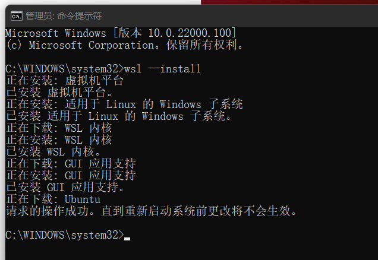
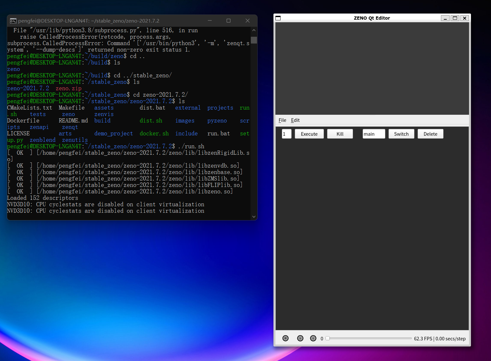
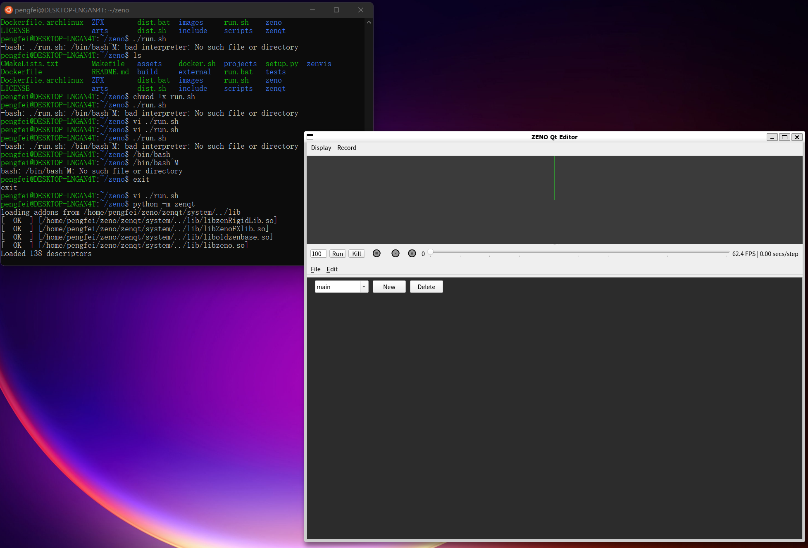

# 在WSL中安装完整的ZENO(部分失败)


1. 加入 windows 预览体验计划，将系统更新到 windows 11。

2. 用管理员身份打开命令行窗口，执行`wsl --install`，然后重启。[参考](https://docs.microsoft.com/zh-cn/windows/wsl/install-win10)



3. 安装gedit，如果能弹出窗口，表示[WSLg](https://github.com/microsoft/wslg)安装成功。


> [什么是WSLg](https://zhuanlan.zhihu.com/p/377263437)：直接可以在wsl命令窗口中打开linux系统中的GUI程序，GUI程序的窗口就像是Windows中的普通程序一样显示。我希望能够安装有图形界面的WSL，这样才能使用ZENO。


>修改文件 /etc/apt/sources.list 更新ubuntu的源。
>
>```
>deb http://mirrors.aliyun.com/ubuntu/ focal main restricted universe multiverse
>deb-src http://mirrors.aliyun.com/ubuntu/ focal main restricted universe multiverse
>
>deb http://mirrors.aliyun.com/ubuntu/ focal-security main restricted universe multiverse
>deb-src http://mirrors.aliyun.com/ubuntu/ focal-security main restricted universe multiverse
>
>deb http://mirrors.aliyun.com/ubuntu/ focal-updates main restricted universe multiverse
>deb-src http://mirrors.aliyun.com/ubuntu/ focal-updates main restricted universe multiverse
>
>deb http://mirrors.aliyun.com/ubuntu/ focal-proposed main restricted universe multiverse
>deb-src http://mirrors.aliyun.com/ubuntu/ focal-proposed main restricted universe multiverse
>
>deb http://mirrors.aliyun.com/ubuntu/ focal-backports main restricted universe multiverse
>deb-src http://mirrors.aliyun.com/ubuntu/ focal-backports main restricted universe multiverse
>```

#### 安装默认版本的zeno

基本照着Dockerfile来就行了

```
sudo apt-get update
sudo apt-get upgrade -y
sudo apt-get install -y wget git gcc g++ make cmake libboost-iostreams-dev libboost-system-dev libtbb-dev libilmbase-dev libopenexr-dev zlib1g-dev libeigen3-dev libopenblas-dev python-is-python3 python-dev-is-python3 python3-pip libglvnd-dev libglapi-mesa qt5dxcb-plugin
```

```
git clone https://gitee.com/codespace1212/c-blosc.git --depth=1 --branch=v1.5.0
```

```
cd c-blosc && mkdir build && cd build && cmake .. && make -j32 && sudo make install && cd ../..
```

```
git clone https://gitee.com/zeng_gui/openvdb.git --depth=1
```

```
cd openvdb && mkdir build && cd build && cmake .. && make -j32 && sudo make install && cd ../..
```

```
pip3 config set global.index-url https://mirrors.aliyun.com/pypi/simple/
```

```
pip3 install pybind11 numpy PySide2
```

```
cmake -B build
make -C build -j16
```

运行

```
 python -m zenqt
```




### 安装完整版本的zeno

#### 安装cmake3.21

因为部分拓展的编译需要版本3.19以上的cmake，安装过程参考[Kitware APT Repository](https://apt.kitware.com/)。过程中可能需要输入用户密码，所以一行一行粘贴比较好。

```
wget -O - https://apt.kitware.com/keys/kitware-archive-latest.asc 2>/dev/null | gpg --dearmor - | sudo tee /usr/share/keyrings/kitware-archive-keyring.gpg >/dev/null
echo 'deb [signed-by=/usr/share/keyrings/kitware-archive-keyring.gpg] https://apt.kitware.com/ubuntu/ focal main' | sudo tee /etc/apt/sources.list.d/kitware.list >/dev/null
sudo apt-get update
sudo rm /usr/share/keyrings/kitware-archive-keyring.gpg
sudo apt-get install kitware-archive-keyring
sudo apt-get install cmake
```

#### 安装cuda

安装驱动，然后安装cuda toolkits


#### 最后安装完整的zeno

gmpm部分安装失败，undefined reference，提示gmpm有个.so文件没有链接成功。其他应该都能用。qt5dxcb-plugin

